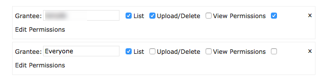
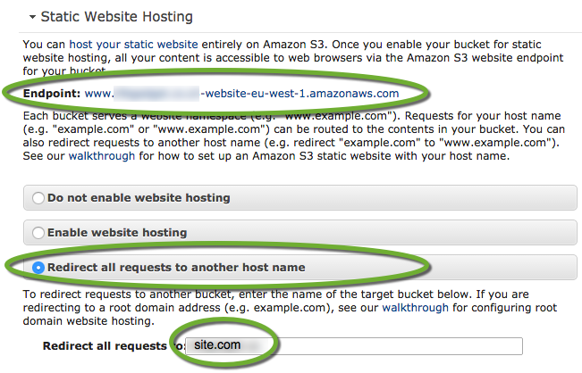
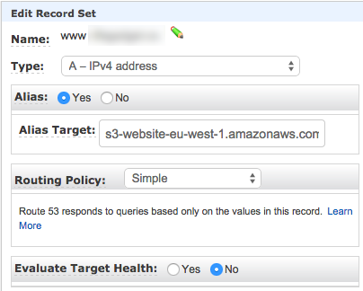

# AWS Pusher
> automated deployments to an opinionated AWS architecture

## Overview and Installation
The goal of this component is to aid in the deployment to a cost-effective, test-effective, and fully automated deployment process for people who use AWS as their production (and test-prod) architecture. This solution is available on **npm** and can be installed with:

````bash
# Install globally
npm install -g aws-pusher
# initialize your project (from within project directory)
pusher init
````

The *aws-pusher* application is available as a CLI application to start with the following commands:

1. [`pusher init`](init-checklist.md)
	
	- run after installation, sets up the AWS environment

1. `pusher status`

	This will give a status of your current app deployments to AWS, including:

	- **S3 Structure**
		- Does an S3 bucket/folder exist for your current sandbox? For the tagged releases? For the last *x* pushes?
	- **S3 Content State**
		- Are there any new *commits* or *tagged releases* in **git** that haven't been published yet?
		- The last published "sandbox" release to AWS
	- **CloudFront**
		- Are there distributions pointing to this app's prod, release, commit, and sandbox environments?
		- Do appropriate "origins" and "behaviors" exist for each distribution? 
		- Are these distributions in the "ready" state?
		- Is SSL configured? (warning only)
	- **EC2**
		- Tests that specified "origin" is up and ready (warning only if not)
		> Note: EC2 is ignored unless configuration is specified; automation is strictly for static asset deployment
	- **Route53**
		- Validates that root A-record for domain is established (errors out if it is not, not it's job to change this)
		- Validates that all current cloudfront distributions are represented with sub-domain A-record in Route53

2. `pusher push`

	The "push" command responds to a user request to build and deploy the users current *sandboxed* code to AWS. 

	> **Note**: in order for this to be fully automated the *pusher* configuration will need to first build the latest version of the code and *then* push it to 
	to the AWS architecture. This requires that either the static framework is known (for now just Ember) or that the pusher configuration provides a hook to allow 

3. `pusher commit`

	The "commit" can be run as a CLI command but is more typically attached to git's `post-commit` hook. This ensures that whenever a 
	`git push` is made that **pusher** has a chance to ensure AWS is up-to-date.

### Ember Awareness ###

This tooling is meant to deploy static assets to an opinionated AWS architecture *regardless* of the underlying static site's technology. That said, over time 
it will be helpful for the `pusher push` command to understand how to plug into the static assets build pipeline. To kick of this contextual awareness, the 
aws-pusher will come with out of the box support for [Ember apps](http://emberjs.com) which use [ember-cli](http://ember-cli.com).


## Target Architecture


## DNS Endpoints


## S3 ##


### Bucket Policy ###

````json
{
	"Version": "2008-10-17",
	"Statement": [
		{
			"Sid": "Allow Public Access to All Objects",
			"Effect": "Allow",
			"Principal": {
				"AWS": "*"
			},
			"Action": "s3:GetObject",
			"Resource": "arn:aws:s3:::teamfitness.co/*"
		}
	]
}
````

### Permissions ###



### Redirects ###

Hosting the same site off of `http://WWW.site.com` *and* `http://site.com` is not good for your SEO juju so you'll want to redirect. Is that a problem? Nope. But it may be a surprise that this happens at the S3 level rather than Route53. Whether you decide to force the 'www' or lose it make very little difference, this example will assume that the redirection will be done toward *removing* the 'www':

1. Create a S3 bucket called 'www.site.com', then configure it like so:

	

2. Now go to **Route53** and create a A record (as an Alias) which points to your "Endpoint" defined for your new bucket. 

		

All done.

## GZIP

The pusher script is going to push all your CSS and JS files with a content-type of 'gzip'. That is good. Your ember build is going to produce CSS and JS that are *not* gzipped. That is bad. Problem solved:

````bash
ember install:addon ember-cli-gzip
````

And then modify your Brocfile:

````js
var app = new EmberApp({
	gzip: {
		appendSuffix: false
	}
});
````