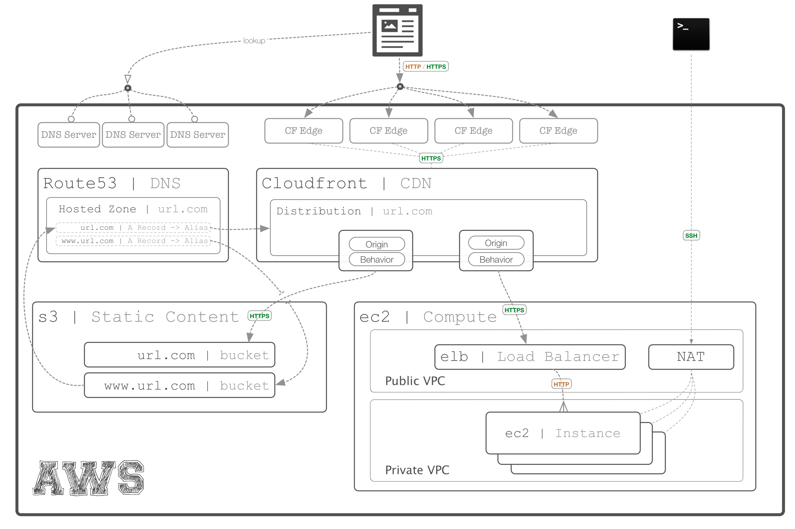
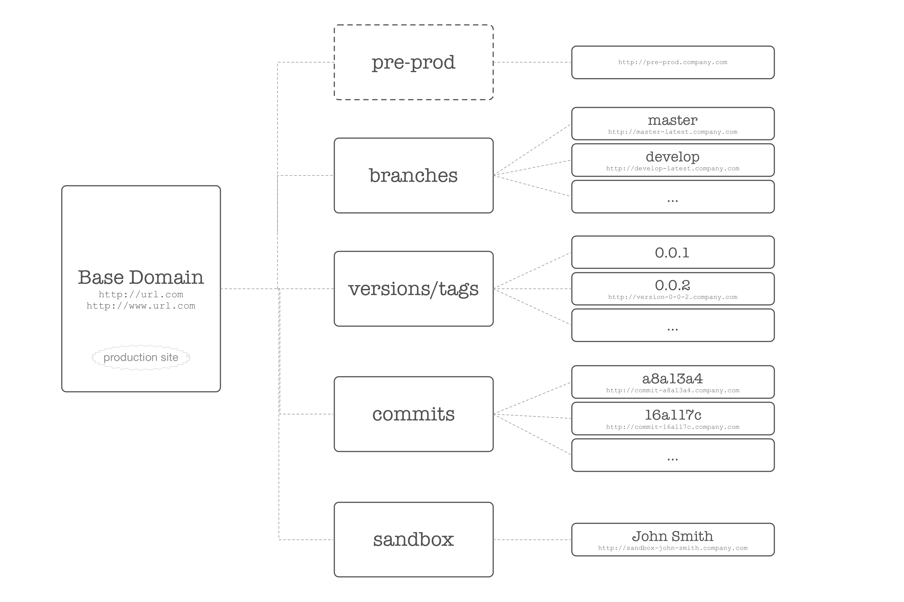

# AWS Pusher
> automated deployments to an opinionated AWS architecture

## Overview and Installation
The goal of this component is to aid in the deployment to a cost-effective, test-effective, and fully automated deployment process for people who use AWS as their production (and test-prod) architecture. This solution is available on **npm** and can be installed with:

````bash
# Install globally
npm install -g aws-pusher
# initialize your project (from within project directory)
pusher init
````

The *aws-pusher* application is available as a CLI application to start with the following commands:

1. `pusher init`
	
	- run after installation, sets up the AWS environment

1. `pusher status`

	This will give a status of your current app deployments to AWS, including:

	- **S3 Structure**
		- Does an S3 bucket/folder exist for your current sandbox? For the tagged releases? For the last *x* pushes?
	- **S3 Content State**
		- Are there any new *commits* or *tagged releases* in **git** that haven't been published yet?
		- The last published "sandbox" release to AWS
	- **CloudFront**
		- Are there distributions pointing to this app's prod, release, commit, and sandbox environments?
		- Do appropriate "origins" and "behaviors" exist for each distribution? 
		- Are these distributions in the "ready" state?
		- Is SSL configured? (warning only)
	- **EC2**
		- Tests that specified "origin" is up and ready (warning only if not)
		> Note: EC2 is ignored unless configuration is specified; automation is strictly for static asset deployment
	- **Route53**
		- Validates that root A-record for domain is established (errors out if it is not, not it's job to change this)
		- Validates that all current cloudfront distributions are represented with sub-domain A-record in Route53

2. `pusher push`

	The "push" command responds to a user request to build and deploy the users current *sandboxed* code to AWS. 

	> **Note**: in order for this to be fully automated the *pusher* configuration will need to first build the latest version of the code and *then* push it to 
	to the 

3. `pusher commit`

	The "commit" can be run as a CLI command but is more typically attached to git's `post-commit` hook. This ensures that whenever a 
	`git push` is made that **pusher** has a chance to ensure AWS is up-to-date.

### Ember Awareness ###

This tooling is meant to deploy static assets to an opinionated AWS architecture *regardless* of the underlying static site's technology. That said, over time 
it will be helpful for the `pusher push` command to understand how to plug into the static assets build pipeline. To kick of this contextual awareness, the 
aws-pusher will come with out of the box support for [Ember apps](http://emberjs.com) which use [ember-cli](http://ember-cli.com).


## Target Architecture


## DNS Endpoints


